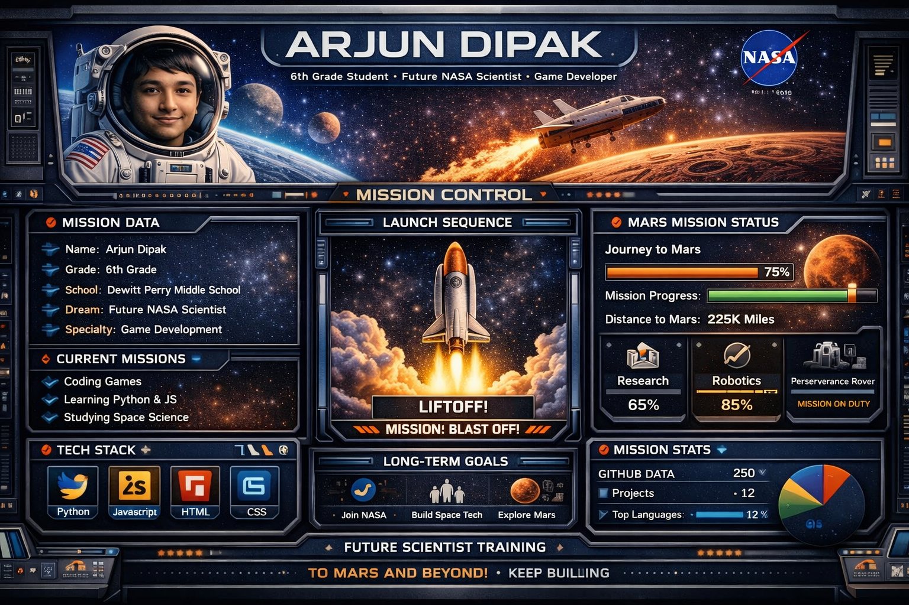

<!-- 👀 Profile Views (Top Left) -->

  

<!-- 👋 Name & Title (Inspired Order) -->
<h1 align="center">Hi, I'm Arjun Dipak 👋</h1>
<h3 align="center">12 Years Old • 6th Grade Student • Future NASA Scientist 🚀 • Game Developer</h3>

<!-- 🌌 Inspiration Banner -->

  

---

## 👨‍🚀 Mission Control: About Me

- 🎓 6th Grade Student at Dewitt Perry Middle School  
- 🚀 Dream: Become a NASA Scientist  
- 💻 Love coding games and building cool projects  
- 🌌 Passionate about space exploration  
- 🧠 Always learning something new  

---

## 🌠 Current Missions

- 🕹️ Building fun coding games  
- 🐍 Learning Python  
- 🌐 Learning JavaScript  
- 🔭 Studying space science  

---

## 🛠️ Tech Stack

  

---

## 🌎 Long-Term Mission Goals

- 🛰️ Work at NASA  
- 🚀 Design space missions  
- 🔴 Contribute to Mars exploration  
- 🎮 Build educational space games  

---

## 📊 GitHub Stats

  
  

---

## 📈 Activity Graph

  

---

## 🚀 Mission Dashboard

  

---

  🌌 Keep Exploring • Keep Learning • Keep Building 🚀

